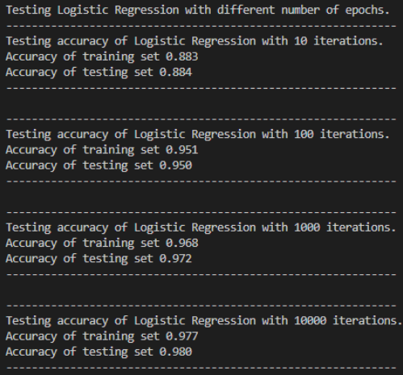
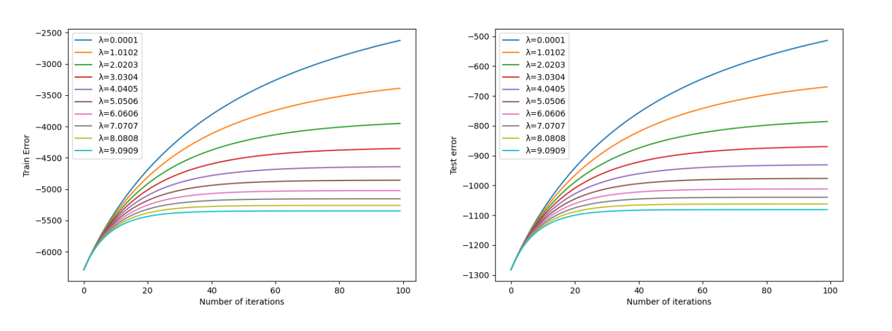
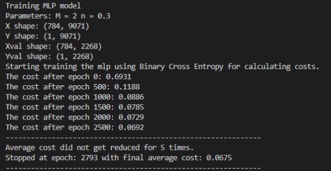
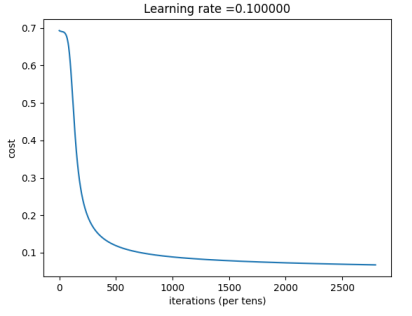
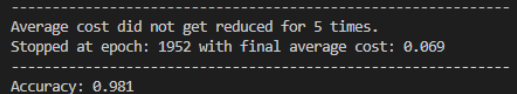

# **About this project**

>The purpose of this Python Project is to build two binary classifiers from scratch and train/evaluate them on a subset of the MNIST dataset, using Tensorflow.

# **Contents**
- [**About this project**](#about-this-project)
- [**Contents**](#contents)
- [**Implementation**](#implementation)
  - [**Part A** (Preprocessing)](#part-a-preprocessing)
  - [**Part B** (Logistic Regression Model)](#part-b-logistic-regression-model)
  - [**Part C** (Neural Network Model)](#part-c-neural-network-model)
- [**Results**](#results)
  - [**Part B** (Logistic Regression Model)](#part-b-logistic-regression-model-1)
  - [**Part C** (Neural Network Model)](#part-c-neural-network-model-1)
- [**Final Notes**](#final-notes)

# **Implementation**

## **Part A** [(Preprocessing)](src/load_dataset.py)

* Downloads data of classes "5" and "6".
* Splits the set into:
  * 80% **train set**.
  * 20% **validation set**.
* Converts all of the downloaded 28x28 pixel images into a 784 vector.
* Converts all elements, of said vectors, from integers in [0, 255] -> real numbers in [0, 1].

## **Part B** [(Logistic Regression Model)](src/logistic_regression.py)

* Implements a logistic regression model from scratch, used for binary classification of classes "5" and "6".
>  * The model is trained with **gradient ascend**.
>  * Trains the classifier using the **training set** for a finite number of iterations.
>  * Evaluates the models **accuracy** on the **test set**.
* Implements L2 regularization.
>  * Trains 100 normalized versions of the classifier, each with a different value of the scalar coefficient λ (normalization hyperparameter L2). The different values ​​of λ must cover a range from 1e-4 to 10.
>  * Evaluates the classification accuracy of each resulting model on the **validation set** separately and selects the one with the smallest **validation error**.
>  * Evaluates the accuracy on the **test set**.

## **Part C** [(Neural Network Model)](src/slp.py)

* Implements a MLP for binary classification as follows:
>  *  **784** neurons in input layer.
>  *  **M** neurons in hidden layer.
>  *  **1** neuron in output later.
>  *  **Logistic sigmoid** as activation function.
>  *  Trains the model using **Gradient Descent** and **Error back-propagation**.
>  *  **Early stopping** during training:
>       *  Calculates the average cost of current epoch.
>       *  Stops the training if the average validation cost shows no decrease for 5 consecutive epochs.
>  *  Saves the model with the minimum mean validation cost.
* Repeats the above procedure, using different hyper parameters *(learning rate η and the number of neurons in hidden layer M)*.
* Returns as optimal the model with the overall minimum average validation cost and records its hyperparameter values **(learning rate, size of hidden layer, epochs)**
* Finally, uses the best trained model to calculate the percentage of correctly classified values of the **test set** and evaluates the **accuracy** bt comparing the prediction of the model with the corresponding label.

# **Results**

## **Part B** [(Logistic Regression Model)](src/logistic_regression.py)

* **Accuracy of the models trained with different number of iterations**.  
* **λ value test**.
  * Max accuracy in validation set achieved with **λ=0.0001** : 0.953.
  * Accuracy of test set with **λ=0.0001** : 0.951.
  * Graphs with different λ values showing train errors per iteration number.  

## **Part C** [(Neural Network Model)](src/slp.py)

* The best model was calculated in **2793 epochs**.
* Final average cost of best model was 0.0675.  
* Iteration-cost plot with **η = 0.100**  
* Learning rate-Epochs plot, with different M values in the hidden layer. There are 2 different plots, one showing the models that stopped really early and one that deletes those outliers from the plot, making it easier to read. *(The models may have stopped early due to unlucky random initialization of weights at the beggining which made the average costs of those models not decrease as fast as we wanted them to).*
  * With outliers  -with-outliers.png)
  * Without outliers **(E<=200)**  -without-outliers.png)
* In the second plot it is clear that the number of epochs needed during training decreases as the learning rate increases. For all values of M *(except for M=1024)* the appropriate gradient descent learning rate is close to 0.5, since that's where we have the fewest epochs during training. In this particular fit, for **M=1024** the number of epochs seem to increase for **η~(0.3-0.5]**, so the optimal learning rate value for gradient descent will be close to 0.3.
* Optimal model had:
    * **η = 0.44444555555555554**
    * **M = 1024**
    * **E = 1952**
    * **cost = 0.069**
    * **accuracy = 98.1%**
* Finally, running the prediction function we get the results listed above and the accuracy  

# **Final Notes**

* Running the MLP model may take a lot of hours, since it trains 100 different models. *(Testing for 10 different M values and 10 η values)* 
* During runtime the [`main.py`](src/main.py) file will generate the following text files:
  * [`results.txt`](src/results.txt) This file contains a row for each different trained MLP model, showing *η, M, Epochs, average cost*.
  * [`bestModel.txt`](src/bestModel.txt) This file contains the optimal MLP model which will later be used to calculate the precision. One row showing *η, M, Epochs, average cost* and one showing the final accuracy of the optimal model on the test set.
  * Additional info on how each part works can be found in comments inside the files themselves.